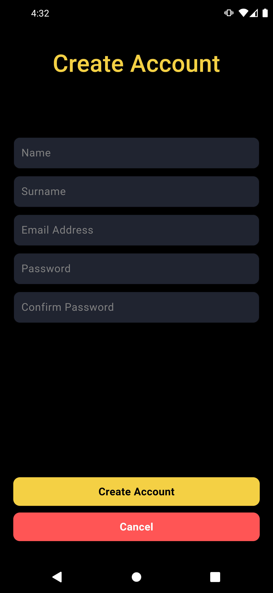
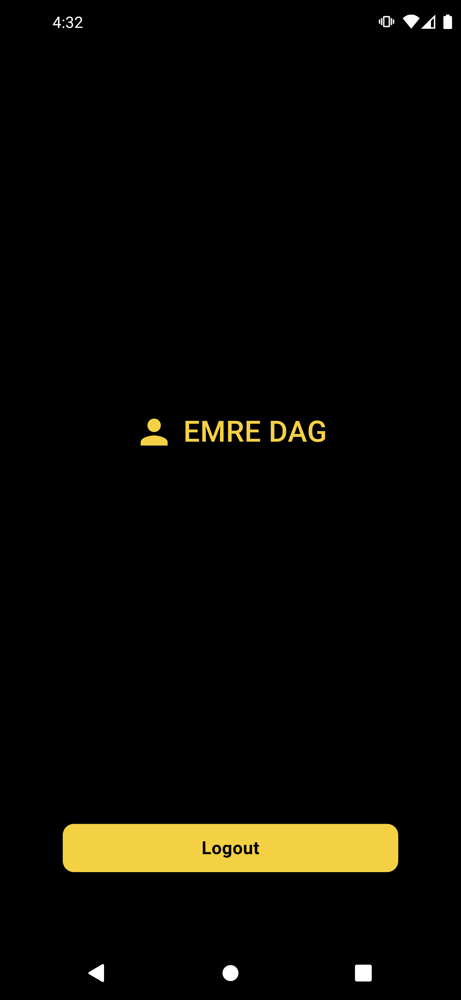

# Flutter Projesi

Bu proje, Firebase kullanarak kullanıcı girişi ve kaydı yapan, "Remember Me" özelliği ile kullanıcı bilgilerini hatırlayan ve Firebase'den kullanıcı bilgilerini alan bir Flutter uygulamasıdır. Uygulamanın işlevleri aşağıda detaylı olarak açıklanmıştır.

## Özellikler

### 1. Splash Screen
- **SplashScreen**: Uygulama açıldığında ilk olarak gösterilen ekrandır. Bu ekranda kısa bir süreliğine gif gösterilmektedir.

### 2. Kullanıcı Girişi ve Kayıt Olma
- **Firebase Authentication**: Kullanıcıların Firebase Authentication kullanarak giriş yapmalarını ve yeni hesap oluşturmalarını sağlar.
- **Giriş Sayfası**: Kullanıcıların e-posta ve şifrelerini girerek giriş yapabilecekleri sayfa.
- **Kayıt Sayfası**: Yeni kullanıcıların e-posta ve şifre bilgilerini girerek hesap oluşturabilecekleri sayfa.

### 3. Remember Me Özelliği
- **Remember Me Checkbox**: Giriş sayfasında "Remember Me" checkbox'ı bulunur. Bu seçenek işaretlendiğinde, kullanıcı çıkış yaptıktan sonra bile bilgileri TextField'larda otomatik olarak doldurulur.
  - **Shared Preferences**: Kullanıcı bilgilerini cihazda saklamak için kullanılır.

### 4. Ana Sayfa
- **Kullanıcı Bilgileri**: Firebase'den alınan kullanıcı adı ve soyadı ana sayfada görüntülenir.
- **Logout Butonu**: Kullanıcıların çıkış yapmasını sağlar ve giriş sayfasına geri döner.

### 5. Firebase Entegrasyonu
- **Firebase Authentication**: Kullanıcı girişi, kaydı ve kimlik doğrulaması için kullanılır.
- **Firebase Firestore**: Kullanıcı bilgilerini almak ve göstermek için kullanılır.

## Kurulum ve Çalıştırma

1. **Flutter SDK**: Flutter SDK'nın kurulu olduğundan emin olun. Eğer kurulu değilse [Flutter kurulum talimatlarını](https://flutter.dev/docs/get-started/install) takip edin.
2. **Firebase Projesi**: Firebase Console'da yeni bir proje oluşturun ve gerekli Firebase konfigürasyon dosyasını (`google-services.json` veya `GoogleService-Info.plist`) Flutter projenize ekleyin.
3. **Gerekli Paketleri Yükleyin**:
    ```bash
    flutter pub get
    ```
4. **Uygulamayı Çalıştırın**:
    ```bash
    flutter run
    ```

## Kullanılan Paketler

- `firebase_core`: Firebase'i Flutter projesine entegre etmek için.
- `firebase_auth`: Firebase Authentication için.
- `cloud_firestore`: Firebase Firestore veritabanı için.
- `shared_preferences`: Kullanıcı bilgilerini cihazda saklamak için.

## Ekran Görüntüleri

### Splash Screen


### Giriş Sayfası


### Kayıt Sayfası


### Ana Sayfa


